# Bluetooth LED Strip control (with Google Assistant)

<p align="center">
    
</p>

## Background

Searching the Internet lead me to a few cheap LED strips from China (thank you **Aliexpress**) for under 1€/meter. The strip include 30 LEDs, the Bluetooth controller and a 5v power supply (an USB connector). As you can expect there was no documentation about the product - just a link to download the Android App (Happy Lightning).

A few days later I find another deal (this time on **Amazon**). The package include 10 meters of strip (30 LEDs/meter), Bluetooth-RF controller, RF remote control and 12v power supply. It sounded very professional, but there was **not** documentation either about the product - just the same link to the Android App.

<p align="center">
    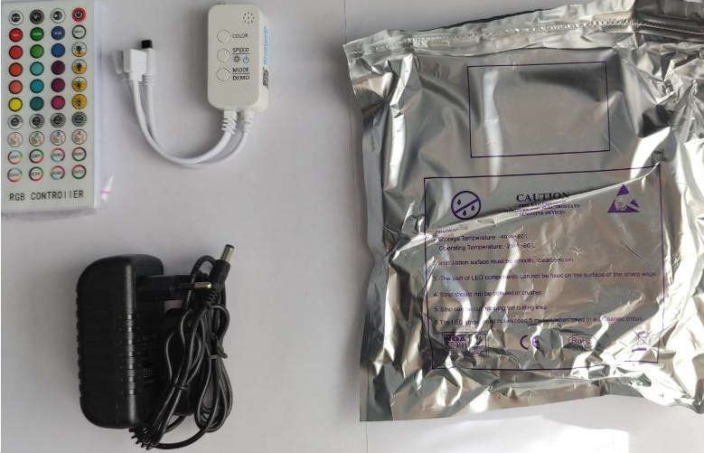
    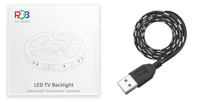
    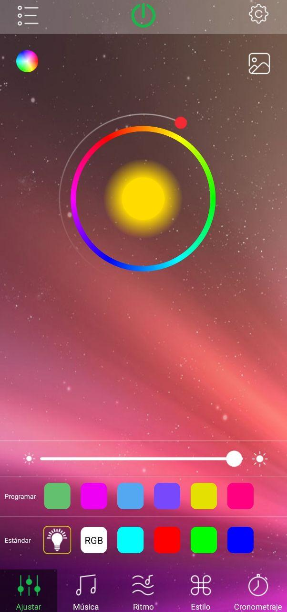
</p>

So I decided to investigate how to control these strips using Google Assistant, a Raspberry Pi (RPI) and my programming skills.

Finally I have developed an API-REST (over **Python**) to control the LED strip with a RPI. Also **IFTTT** is used to create the Google Assistant <-> API requests communication.

## Contents

- [Acknowledgements And Resources](#acknowledgements-and-resources)
- [Disclaimer](#disclaimer)
- [1. Intro and Setup](#intro-and-Setup)
  - [LED Strip Reverse Engineering](#led-strip-reverse-engineering)
  - [API Server](#api-server)
  - [Google Assistant / IFTTT](#google-assistant-ifttt)
- [2. Sniffing Bluetooth packets and reverse engineering the commands](#sniffing-bluetooth-packets-and-reverse-engineering-the-commands)
  - [Requirements](#requirements)
- [3. Creating an API-REST service](creating-an-api-rest-service)
  - [Requirements](#requirements)
- [4. Google Assistant integration with the API-REST](google-assistant-integration-with-the-api-rest)
  - [Requirements](#requirements)
  - [Static IP configuration (RPI specific)](static-ip-configuration-rpi-specific)
  - [DDNS configuration (DuckDNS)](ddns-configuration-duckdns)
  - [Port-Forwarding configuration (depends on the router model)](#port-forwarding-configuration-depends-on-the-router-model))
## Acknowledgements and resources

The information of this guide is based on the tutorials from:
  - **Led strip with Bluetooth Control**
    - [Reddit](https://www.reddit.com/r/homeassistant/comments/gnjqlp/reverse_engineering_bluetooth_led_strip_light/) : Reverse engineering of a Bluetooth LED strip - I
    - [Blog](http://nilhcem.com/iot/reverse-engineering-bluetooth-led-name-badge) : Reverse engineering of a Bluetooth LED strip - II
    - [Medium](https://medium.com/@urish/reverse-engineering-a-bluetooth-lightbulb-56580fcb7546) : Reverse engineering of a Bluetooth LED strip - III
  - **Server/API**
    - [Medium](https://medium.com/@sidhantpanda/raspberry-pi-home-automation-with-google-assistant-integration-part-1-software-71b3b8904205) : API creation - I
    - [Medium](https://medium.com/sysf/introduction-to-iot-with-raspberry-pi-and-node-js-using-rgb-led-lights-77f4750a5ea9) : API creation - II
    - [Blog](https://blog.miguelgrinberg.com/post/designing-a-restful-api-with-python-and-flask) : API creation - III
  - **Google Assistant**
    - [Intructables](https://www.instructables.com/Google-Home-Raspberry-Pi-Power-Strip/) : Google Assistant implementation - I
    - [Programminghistorian](https://programminghistorian.org/en/lessons/creating-apis-with-python-and-flask#installing-python-and-flask) : Google Assistant implementation - II

## **Disclaimer:**
**In theory, it is impossible to brick your RPI or strips using this method, but I don't take responsibility for any damage caused.**  
If you find any mistakes in this tutorial, _please_ submit a PR 👍🏻

## Intro and setup

The basic set-up for the project is:

<p align="center">
    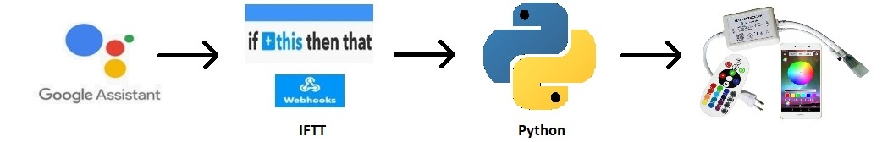
</p>

### LED strip reverse engineering
1. A LED strip with a Bluetooth controller.
2. A computer with ADB drivers installed.
3. A mobile phone with Android (with the **LED strip app** and the **nRF Connect app**).
4. An USB type C cable (or similar).
5. General knowledges of Wireshark and packet sniffing

### API Server
1. A RPI with Raspbian installed.
2. An IDE (Atom or similar).
3. General knowledges of Python and API operation.

### Google Assistant / IFTTT
1. A Google account and an IFTTT account.

## Sniffing Bluetooth packets and reverse engineering the commands
### Requirements
A little bit of information about how a Bluetooth Low Energy device work:
>In Bluetooth Low Energy, devices can perform one of two roles. A device can be either a “Central” (in this example, your phone) or a “Peripheral” (and respectively, the bulb).

>Bluetooth devices have **services** that correspond to one function of the device. Each service exposes variables/properties called **characteristics**. The characteristics represent one parameter of the service, which can be read, written or both. For example, in the Battery service above, it will have a Battery Level Characteristic, a read-only value containing 1-byte value between 0 and 100, reporting percentage of battery remaining in the device. A temperature service can have one characteristic for the temperature, and another one for the humidity, both are read-only. A smart bulb service can have one characteristic for the on/off switch (writing 0 turns it off, 1 on), and another characteristic for the brightness (0 to 100 or so), which can be either write-only or read+write.

>Peripherals periodically advertise which services they have (usually once per second or so). Centrals (such as your phone) see those advertisements, and can initiate a connection with any peripheral around them, and start reading/writing from the characteristics exposed by its services. Each service and characteristic is identified by a unique 16-bit or 128-bit number, such as `ff05` (16bit) or `00000000–0000–1000–8000–00805F9B34FB` (128bit). 16bits are reserved for standard services and characteristics, such as the Battery Level service mentioned before, and are defined by the Bluetooth SIG Group. Nevertheless, many consumer devices like to use them for their own purposes.
> - Uri Shaked/Medium.com

 Some services and characteristics (not all are available) of my Bluetooth Controller are:
- **0x1800 (Generic Access)**
  - 0x2A00 (Device Name)
  - 0x2A01 (Appearance)
  - 0x2A02 (Peripheral Privacy Flag)
- **0x1801 (Generic Attribute)**
  - 0x2A05 (Service Changed)
- **0x180A (Generic Information)**
  - 0x2A29 (Manufacturer Name String) --> Beken
  - 0x2A24 (Model Number String)
  - 0x2A25 (Serial Number String)
  - 0x2A26 (Firmware Revision String)
  - 0x2A27 (Hardware Revision String)
  - 0x2A28 (Software Revision String)
  - 0x2A23 (System ID)
  - 0x2A2A (IEEE 11073-20601 Regulatory Certification)
  - 0x2A50 (PnP ID)
- **0xFFD5 (Unknown Service)** --> Led control service
  - 0xFFDA (Unknown Characteristic)
  - 0xFFD9 (Unknown Characteristic) -> LED control characteristic
- **0xFFD0 (Unknown Service)**
  - 0xFFD4 (Unknown Characteristic)
  - 0xFFD1 (Unknown Characteristic)

### Enable USB debugging on your Android device and Bluetooth HCI Snoop Mode

1. To enable Developer Options, open the `Settings screen`, scroll down to the bottom, and tap `About phone or About tablet`. Scroll down to the bottom of the About screen and find the Build number. Tap the `Build number` field seven times to enable **Developer Options**. Tap a few times and you’ll see a toast notification with a countdown that reads “You are now X steps way from being a developer.”
2. Tap the Back button and you’ll see the `Developer options` menu just above the “About Phone” section in Settings. This menu is now enabled on your device—you won’t have to repeat this process again unless you perform a factory reset.
3. To enable **USB Debugging**, you’ll need to jump into the Developer options menu, scroll down to the Debugging section, and toggle the “USB Debugging” slider.
4. Also in the Developer options screen select `Enable Bluetooth HCI snoop log`. The log file is now enabled.
5. Now activate the Bluetooth and use the Control App of the Strips (turn on/off a few times, change the color, etc).

### Analyzing the btsnoop_hci.log with Wireshark

1. To retrieve and analyze the .log, download and unzip [ADB](https://dl.google.com/android/repository/platform-tools-latest-windows.zip) on your computer.
2. Open a `Powershell` terminal with superuser control (`Right-click` the PowerShell shortcut in your taskbar or Start Menu, or on your Desktop and select `Run as Administrator` to open a PowerShell window that runs with admin privileges).
3. Move to the directory where you unzip the file (with the `cd` command) and run:
```powershell
./adb.exe shell dumpsys bluetooth_manager
./adb.exe bugreport > BUG_REPORT.txt
```
Probably you have to accept the conection in yout mobile phone (to grant permission to the PC).

4. After a few minutes a .zip file will be created in the directory, unzip it and move to the directory `\data\misc\bluetooth` there you can find the **.log file**.
5. Open the file with **Wireshark** and filter the captured messages (the src and dst field are good choices)

<p align="center">
    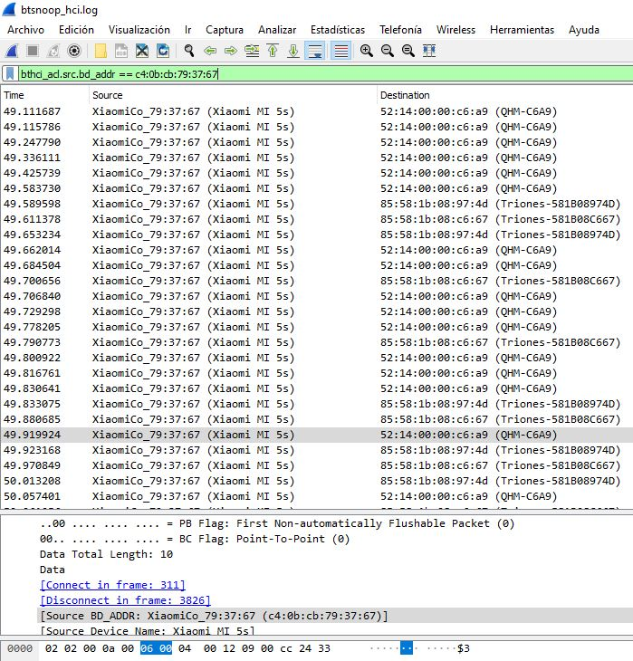
</p>

6. Now you have to look for changes on the Hexadecimal message. In my case, for this Bluetooth controller:

| Commom Part                         | Value                    |
| ----------------------------------- |:------------------------:|
| 02 03 00 0e 00 0a 00 04 00 12 28 00 | 56 **00 ED FF** 00 f0 AA |
| 02 03 00 0e 00 0a 00 04 00 12 28 00 | 56 **RR GG BB** 00 f0 AA

With Wireshark you can see that those messages use the characteristic **0xFFD9** (associated to **0xFFD5** service). Now changing the marked values (RR, GG, BB) set an specific color (you can test this with the **nRF Connect app**).

<p align="center">
    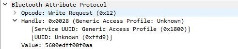
</p>

A list of codes for this specific controller is:
- **Switch ON:** CC 23 33
- **Switch OFF:** CC 24 33
- **Set COLOR:** 56 **RR GG BB** 00 f0 AA
- ...

## Creating an API-REST service
### Requirements

## Google Assistant integration with the API-REST
### Requirements
After defining the **API-REST** methods, you need to configure a **Static IP** on your RPI, configure a **DDNS** service and configure **Port-forwarding** on your router's firewall.

In addition to that, you need to set the **IFTTT services**. IFTTT refers to:
> If This Then That (commonly known as IFTTT, /ɪft/) is a web-based service that allows users to create chains of conditional statements triggered by changes that occur within other web services such as Gmail, Facebook, Telegram, Instagram, Pinterest or Google Assistant.
> - Wikipedia

### Static IP configuration (RPI specific)
1. You need to edit the /etc/dhcpcd.conf file
```sh
sudo nano /etc/dhcpcd.conf
```
2. Inside the file uncomment and edit the following lines (you need to indicate an IP within the range of your network, the IP of your router and your favorite DNS provider's IP)
```sh
# Example static IP configuration:
interface eth0
static ip_address=192.168.0.10/24
static routers=192.168.0.1
static domain_name_servers=192.168.0.1 8.8.8.8 fd51:42f8:caae:d92e::1
```
3. Finally save the file (CTRL+o) and reboot the System
```sh
sudo reboot
```

### DDNS configuration (DuckDNS)
1. Go to the [DuckDNS](https://www.duckdns.org/) website and sign up with your Google account (or other via).
2. The web will redirect you to the administration panel, you need to enter a name for your domain and press "add domain". The **domain** and you **public IP** will be added below.

<p align="center">
    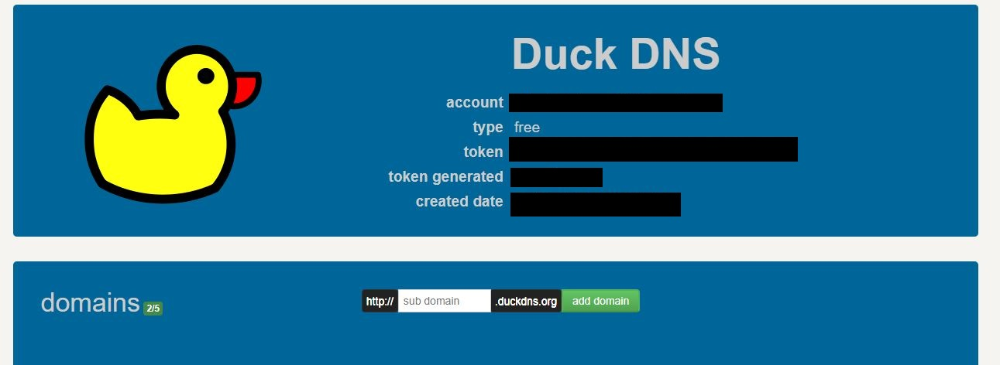  
</p>

3. Now go to [DuckDNS/install](https://www.duckdns.org/install.jsp) and select your **Operating System (OS)** and the domain you want to configure. In this case, we are going the use the RPI to run the DDNS (but as I mention before you can use OpenWRT or other OS).

<p align="center">
    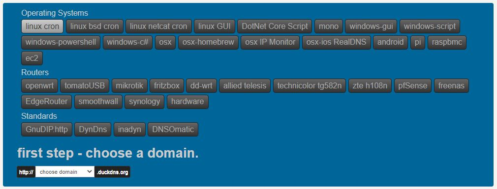  
</p>

4. After choosing a domain, a step by step guide will be deployed. In the case of the RPI:
>If your linux install is running a crontab, then you can use a cron job to keep updated. We can see this with
```sh
ps -ef | grep cr[o]n
```
>If this returns nothing - then go and read up how to install cron for your distribution of linux.
also confirm that you have curl installed, test this by attempting to run curl
```sh
curl
```
>If this returns a command not found like error - then find out how to install curl for your distribution.
otherwise lets get started and make a directory to put your files in, move into it and make our main script
```sh
mkdir duckdns
cd duckdns
sudo nano duck.sh
```
>Now copy this text and put it into the file. The example below is for the domain XXXX. If you want the configuration for a different domain, use the drop down box above. You can pass a comma separated (no spaces) list of domains, you can if you need to hard code an IP (best not to - leave it blank and we detect your remote ip).
```sh
echo url="https://www.duckdns.org/update?domains=XXXX&token=YOUR_TOKEN&ip=" | curl -k -o ~/duckdns/duck.log -K -
```
>Now save the file (CTRL+o and CTRL+x). This script will make a https request and log the output in the file duck.log. Now make the duck.sh file executeable
```sh
sudo chmod 700 duck.sh
```
>Next we will be using the cron process to make the script get run every 5 minutes
```sh
crontab -e
```
>Copy this text and paste it at the bottom of the crontab
```sh
*/5 * * * * ~/duckdns/duck.sh >/dev/null 2>&1
```
>Now save the file (CTRL+o then CTRL+x)lets test the script
```sh
./duck.sh
```
>This should simply return to a prompt. We can also see if the last attempt was successful (OK or bad KO)
```sh
cat duck.log
```
>If it is KO check your Token and Domain are correct in the duck.sh script.
> - DuckDNS.org

### Port-Forwarding configuration (depends on the router model)
1. Go to the web browser and type the private IP of your router (i.e 192.168.0.1)
2. Inside the router administration panel you have to find your firewall/port-forwards setting
3. And create a rule allowing connection from the **WAN** to the **LAN** on the **external port 80 (http)** and destination the **RPI static IP** on the **server port** (generally 5000).

<p align="center">
    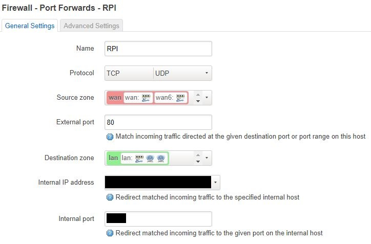
</p>


### IFTTT Configuration
1. Go to [IFTTT](https://ifttt.com) website and create a new account.
2. Click **create** a new **Applet**.
3. In the "If this" rectangle click **add** and search for **Google Assistant**, select it.

<p align="center">
    
</p>

4. Choose "Say a simple phrase" as your trigger (you can choose other option depending of the project you are working on).
<p align="center">
    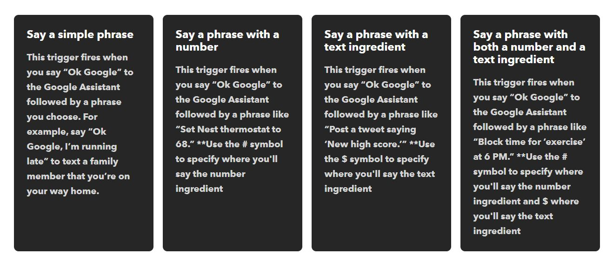
</p>

5. Now choose the phrase and other variations. For example "Turn my lamp on". And the response of the assistant. After that click "Create Trigger" and proceed.

<p align="center">
    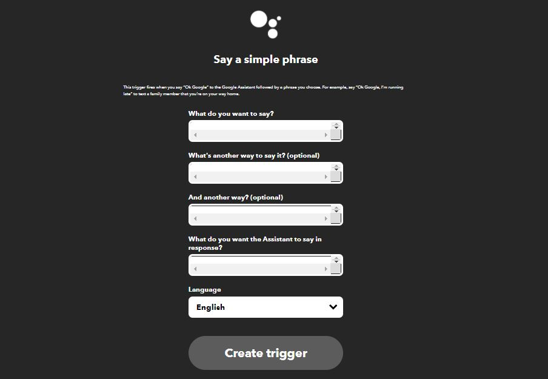  
</p>

6. In the "Then that" rectangle click **add** and search for **Webhooks**, select it.
7. Now select "Make a web request" and set "Method" to POST, "Content Type" should be text/plain and "Body" can be left blank. Finally set the URL to
```
http://ipaddressgoeshere/methodyouwanttocall
```
8. Create your action and choose Finish.
